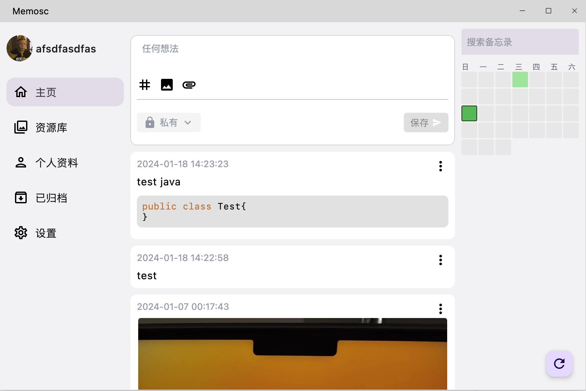

# memosc

[Memos](https://github.com/usememos/memos) client built on Compose Multiplatform

## TODO
- [✅] Packaged cross-platform client (MacOS & Windows & Linux only)
- [✅] Automatic updates 
- [] Customizing the Open API Path
- [] Coming soon...

## Build

https://www.jetbrains.com/help/kotlin-multiplatform-dev/compose-multiplatform-getting-started.html#join-the-community

## Thanks to the following projects for helping me

[memos](https://github.com/usememos/memos)   
[MoeMemosAndroid](https://github.com/mudkipme/MoeMemosAndroid)